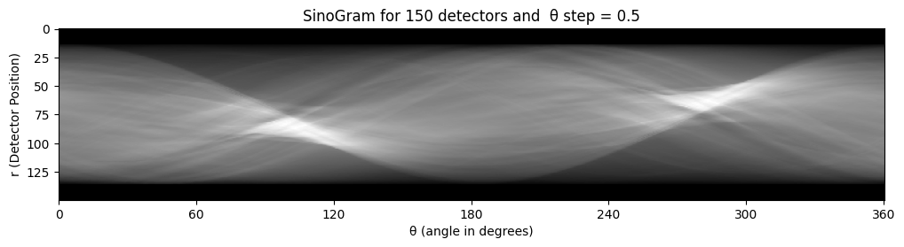
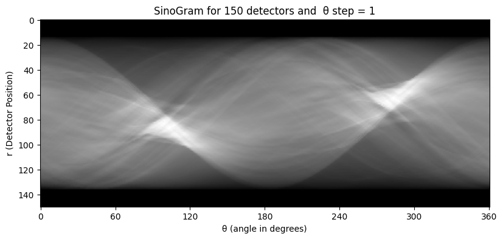
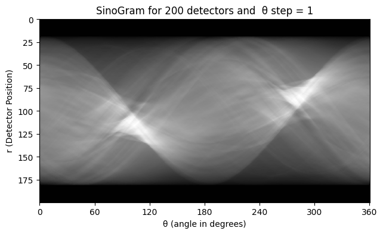
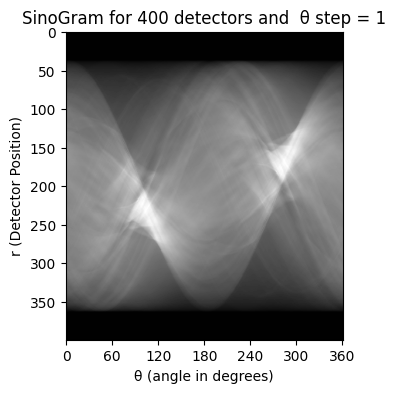

# Report for Part-2 of Assignment-4

## Radon Transform

The provided function `sinogram` is designed to generate a sinogram from a given image using the Radon transform. Here's a summary of the implementation:

### Parameters:
- `image`: Input image for which the sinogram is to be generated.
- `theta1` and `theta2`: Start and end angles for the projections. Default values are set for a full 360-degree rotation.
- `step`: Angular step size for the projections.
- `num_detectors` : Number of detectors for each θ

### Implementation Steps:
1. Calculate the number of projections (`num_thetas`) based on the specified angular range and step size.
2. Initialize an array `sino` to store the sinogram with dimensions `(num_thetas, max(M, N))`.
3. Generate an array of theta values (`thetas`) using `linspace`.
4. Loop over each theta value, rotate the image accordingly using `skimage.transform.rotate`, and sum along the vertical axis to obtain the projection profile.
5. Transpose the sinogram array for easier visualization.
6. Resize the sinogram to a standard size (700 pixels wide) while maintaining the aspect ratio using `cv2.resize`.

### Function for sinogram:
```python
def sinogram(image, theta1=0, theta2=360, step=18):
    num_thetas = int((theta2-theta1)/step)
    M, N = image.shape
    sino = np.zeros((num_thetas, max(M, N)))
    thetas = np.linspace(theta2, theta1, num_thetas)

    for i, theta in enumerate(thetas):
        rotated_image = rotate(image, theta, reshape=False)
        sino[i] = np.sum(rotated_image, axis=0)

    sino = sino.T
    
    # resizing the sinogram to a standard siza 
    original_height, original_width = sino.shape[:2]
    new_width = 700
    new_height = int((new_width / original_width) * original_height)
    resized_sino = cv2.resize(sino, (new_width, new_height))

    return resized_sino
```

### Other functions 
- `convert_circular()` : Creates a circular mask and applies it to the input image, effectively preserving pixel values within the circular region while setting values outside the circle to zero.

- `contrast_stretch()` : Performs contrast stretching on an input image, mapping pixel values to a specified intensity range (min_val to max_val). This enhances the image's contrast by redistributing pixel values based on the original minimum and maximum intensities.


## Observations on Variations in θ step and number of detectors

### Step Size of θ:

- **Smaller Step Size (Fine Angular Sampling):**
  - Results in more projections covering a full 360 degrees.
  - Provides higher angular resolution, revealing more details about the image's structures.

- **Larger Step Size (Coarse Angular Sampling):**
  - Reduces the number of projections, leading to lower angular resolution.
  - May later result in missing finer details and potential artifacts in the reconstructed image.

|         | |
| ---------------------- | ---------------------- |
|       |     |


### Number of Detectors (Range of r):
- **More Detectors (Fine Radial Sampling):**
  - Increasing the number of detectors provides more data points along each projection.
  - Improves radial resolution, capturing fine details and helping in better reconstruction.

- **Fewer Detectors (Coarse Radial Sampling):**
  - Decreasing the number of detectors may result in undersampling along each projection.
  - Can lead to artifacts in the reconstructed image.

|         | |
| ---------------------- | ---------------------- |
|       |     |


